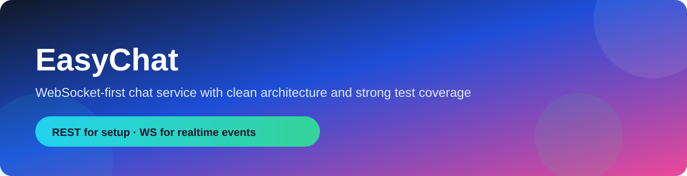
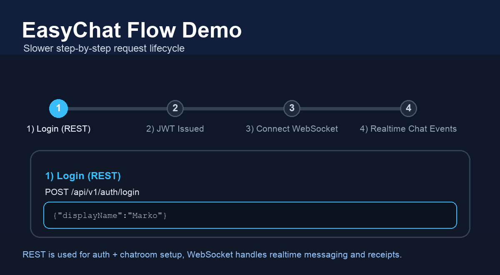

# EasyChat



EasyChat is a WebSocket-first chat service in Go using Clean Architecture (Ports & Adapters).

[](go.mod)
[](https://github.com/markokoen/easychat/actions/workflows/ci.yml)
[](internal)
[](https://goreportcard.com/report/github.com/markokoen/easychat)
[](LICENSE)
[](https://github.com/markokoen/easychat/releases)

## Quick Start (60 sec)

```bash
export JWT_SECRET=dev-secret
make run
open http://localhost:8080/swagger/index.html
```

## Demo



## API Docs (Swagger UI)

[](http://localhost:8080/swagger/index.html)

`http://localhost:8080/swagger/index.html`

## Architecture


## Test Coverage

`go test ./... -coverprofile=coverage.out` → **93.4% statements covered**

## Features

- JWT login (`POST /api/v1/auth/login`)
- Chatroom management via REST
- Real-time messaging, receipts, and presence over WebSockets
- MongoDB persistence with required indexes
- OpenAPI 3 spec + Swagger UI at `/swagger/index.html` (served with local static assets)
- Graceful shutdown and websocket ping/pong health checks

## Project Structure

```text
cmd/server/main.go
internal/
  domain/chat
  app/auth
  app/chat
  interfaces/http
  interfaces/ws
  infrastructure/mongo
  infrastructure/auth
  infrastructure/nats
  platform/config
  platform/logger
  platform/server
docs/
  swagger
  postman
  assets
```

## Environment Variables

- `MONGO_URI` (default: `mongodb://localhost:27017/easychat`)
- `NATS_URL` (reserved for future pub/sub)
- `SERVER_PORT` (default: `8080`)
- `AUTH_PROVIDER_TYPE` (default: `jwt`)
- `JWT_SECRET` (required)

## Postman

- REST collection: `docs/postman/easychat.postman_collection.json`
- WebSocket guide: `docs/postman/WEBSOCKET_SETUP.md`

## API Summary

REST:

- `POST /api/v1/auth/login`
- `POST /api/v1/chatrooms`
- `GET /api/v1/chatrooms/{chatRoomId}`
- `GET /api/v1/chatrooms/reference/{reference}`

WebSocket:

- `GET /ws/chatrooms/{chatRoomId}`
- Header: `Authorization: Bearer <token>`

Envelope:

```json
{
  "type": "string",
  "requestId": "optional",
  "payload": {}
}
```

Errors always use:

```json
{ "message": "human readable error" }
```

## REST API Examples

`POST /api/v1/auth/login`

```json
{
  "userId": "u-123",
  "displayName": "Marko",
  "metadata": { "source": "web" }
}
```

```json
{
  "token": "<jwt>",
  "user": {
    "id": "u-123",
    "displayName": "Marko",
    "metadata": { "source": "web" },
    "createdAt": "2026-02-02T12:00:00Z"
  }
}
```

`POST /api/v1/chatrooms`

```json
{
  "reference": "order-1001",
  "users": [
    { "id": "u-123", "displayName": "Marko" },
    { "id": "u-456", "displayName": "Alex" }
  ]
}
```

```json
{
  "id": "cr-123",
  "reference": "order-1001",
  "users": [
    { "id": "u-123", "displayName": "Marko" },
    { "id": "u-456", "displayName": "Alex" }
  ],
  "createdAt": "2026-02-02T12:01:00Z"
}
```

`GET /api/v1/chatrooms/{chatRoomId}`

```json
{
  "id": "cr-123",
  "reference": "order-1001",
  "users": [
    { "id": "u-123", "displayName": "Marko" },
    { "id": "u-456", "displayName": "Alex" }
  ],
  "createdAt": "2026-02-02T12:01:00Z"
}
```

`GET /api/v1/chatrooms/reference/{reference}`

```json
{
  "id": "cr-123",
  "reference": "order-1001",
  "users": [
    { "id": "u-123", "displayName": "Marko" },
    { "id": "u-456", "displayName": "Alex" }
  ],
  "createdAt": "2026-02-02T12:01:00Z"
}
```
