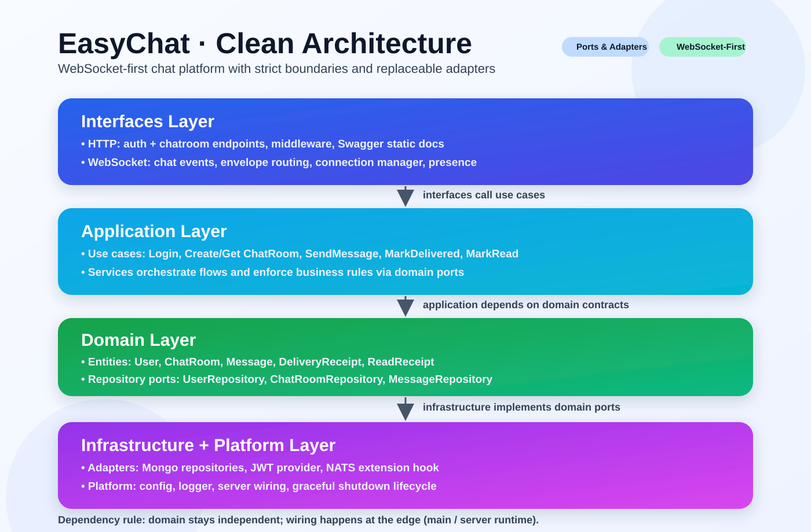

# EasyChat

EasyChat is a WebSocket-first chat service in Go using Clean Architecture (Ports & Adapters).

[](go.mod)
[](internal)

## Test Coverage

`go test ./... -coverprofile=coverage.out` → **93.4% statements covered**

## Architecture



## Features

- JWT login (`POST /api/v1/auth/login`)
- Chatroom management via REST
- Real-time messaging, receipts, and presence over WebSockets
- MongoDB persistence with required indexes
- OpenAPI 3 spec + Swagger UI at `/swagger/index.html` (served with local static assets)
- Graceful shutdown and websocket ping/pong health checks

## Project Structure

```text
cmd/server/main.go
internal/
  domain/chat
  app/auth
  app/chat
  interfaces/http
  interfaces/ws
  infrastructure/mongo
  infrastructure/auth
  infrastructure/nats
  platform/config
  platform/logger
docs/swagger
```

## Environment Variables

- `MONGO_URI` (default: `mongodb://localhost:27017/easychat`)
- `NATS_URL` (reserved for future pub/sub)
- `SERVER_PORT` (default: `8080`)
- `AUTH_PROVIDER_TYPE` (default: `jwt`)
- `JWT_SECRET` (required)

## Run

```bash
JWT_SECRET=dev-secret make run
```

or:

```bash
./scripts/run-local.sh
```

Then open `http://localhost:8080/swagger/index.html`.

## API

REST:

- `POST /api/v1/auth/login`
- `POST /api/v1/chatrooms`
- `GET /api/v1/chatrooms/{chatRoomId}`
- `GET /api/v1/chatrooms/reference/{reference}`

WebSocket:

- `GET /ws/chatrooms/{chatRoomId}`
- Header: `Authorization: Bearer <token>`

Envelope:

```json
{
  "type": "string",
  "requestId": "optional",
  "payload": {}
}
```

Errors always use:

```json
{ "message": "human readable error" }
```
